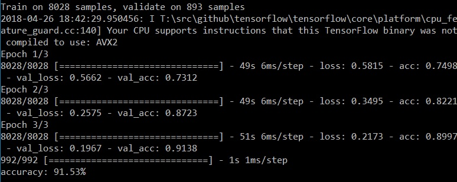

# TensorFlow Malicious Requests Demo
This project demonstrates how to apply TensorFlow and neural networks for detecting malicious requests and visualize results on TensorBoard

# Prerequisites
- Python3
- TensorFlow 
- git

# Clone Repository
Clone the repository and switch to the target directory

```sh
git clone "https://github.com/Dorokhov/tensorflow-keras-malicious-requests-demo"
cd <path_to_source_code_directory>
```

# Demo

## Step 1
### Train Your Model

```sh
python train.py
```



## Step 2
### Visualize Training Results on TensorBoard

Run the following code from command line:

```sh
python tensorboard-visualisation.py
tensorboard --logdir="logs"
```

Copy tensorboard URL and open it in your famous browser:


Open **"Projector"** tab

On the left "Data" panel change **"Color by"** selector to **"Class"** value:


Ensure **"Label Mode"** is **enabled** ("A" icon is checked):


Now, you should be able something like this:


## Step 3
### Evaluate Custom Requests

Evaluate regular request:
```sh
python eval.py '{"username"="vova" "password"="0"}'
```

the system displays accuracy:


Evaluate SQL Injection request:
```sh
python eval.py '{"username"=";drop database" "password"="0"}'
```

the system displays accuracy:


